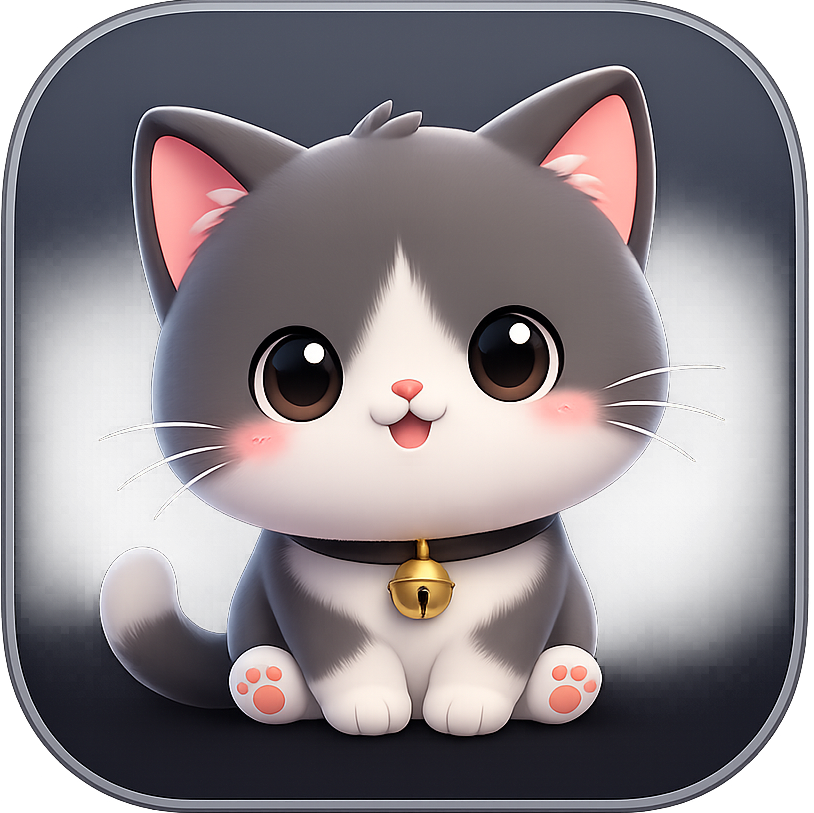

# DesktopPet

DesktopPet 是一个 macOS 桌面宠物应用。它会在桌面上显示一只可拖拽、可贴边、可切换姿势的像素宠物，并提供设置页、菜单栏控制、自定义宠物导入和网页插件面板。

项目使用 SwiftUI + AppKit 构建，当前以 Swift Package 形式组织。



## Features

- 桌面宠物窗口：透明置顶窗口承载宠物精灵图，支持拖拽、贴边、下落和悬停打招呼。
- 多宠物资源：内置多套像素宠物资源，可在设置页中切换。
- 自定义宠物导入：支持导入包含 `pet.json` 和 `png` 精灵图的 `.zip` 宠物包。
- 宠物管理：导入宠物会持久化到应用支持目录，可在设置页删除；删除当前宠物时会回退到默认内置宠物。
- 姿势预览：设置页可预览宠物真实姿势，左爬墙会使用右爬墙素材镜像展示。
- 尺寸调节：支持调整宠物缩放比例，并持久化当前选择。
- 动画控制：菜单栏可暂停或恢复宠物动作，也可一键重置宠物位置。
- 插件面板：点击宠物可打开网页插件面板，默认内置 Trello 插件。
- 插件管理：支持新增、编辑、删除、启用/禁用和排序网页插件。
- 本地持久化：宠物选择、缩放、动画暂停状态和插件配置会保存到本地。

## Requirements

- macOS 13.0+
- Swift 6.0+
- Xcode 或 Swift Package Manager

## Run From Source

```bash
git clone https://github.com/UrienZz/DesktopPet.git
cd DesktopPet
swift run DesktopPetApp
```

也可以用 Xcode 打开 `Package.swift` 后运行 `DesktopPetApp` target。

## Test

```bash
swift test
```

当前测试覆盖宠物运行态、精灵图解析、设置页状态、插件持久化、插件面板选择、自定义宠物导入和菜单栏行为。

## Custom Pet Package

自定义宠物导入使用 `.zip` 包，压缩包内至少需要：

- 一个可解码的宠物 JSON 配置文件。
- JSON 中 `imageSrc` 指向的 PNG 精灵图。

导入后应用会把资源复制到 `Application Support/DesktopPetApp/ImportedPets`，并在需要时自动为重名宠物追加递增后缀。

## Project Structure

```text
Sources/DesktopPetApp/
├── App/          # 应用协调器、偏好存储、应用图标更新
├── Config/       # 应用常量
├── Input/        # 外部点击监听
├── MenuBar/      # 菜单栏入口
├── Panel/        # 插件面板与 WebView
├── Pet/          # 宠物模型、导入、运行态、渲染和精灵图解析
├── Plugin/       # 网页插件配置与持久化
├── Resources/    # App 图标与内置宠物资源
├── Settings/     # 设置页、宠物选择、插件管理、姿势预览
└── Window/       # 宠物窗口、面板窗口和设置窗口
```

## License

当前仓库暂未声明开源许可证。使用、分发或二次开发前请先补充许可证说明。
